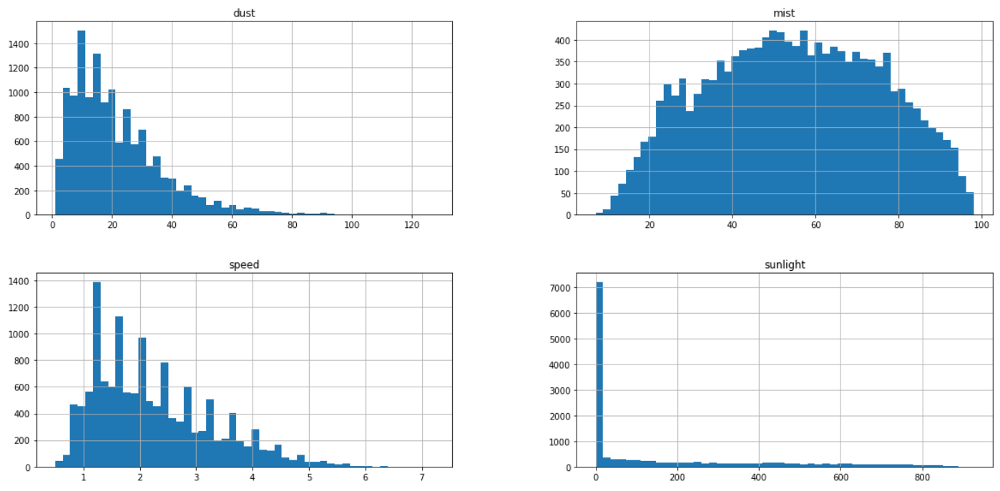
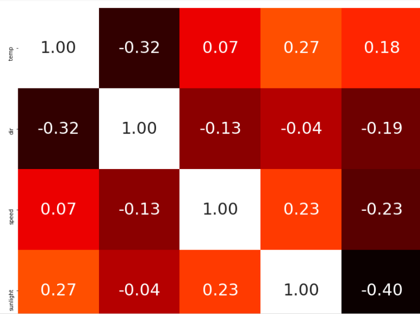
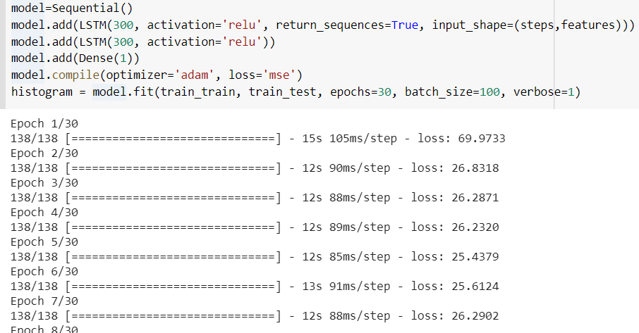
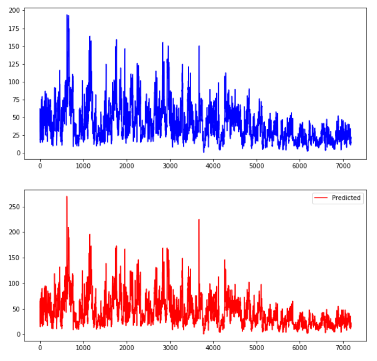

# fine-dust-forecasting-by-deeplearning
Dust forecasting during big data intern

## Topic
Prediction through analysis of fine dust correlation and deep learning
I found that temperature, wind direction and wind speed are important to affect fine dust


## Environment

- python3
- keras
- Colab(Optional - cause Colab provides GPU)

## Installation

```
$ pip install keras
```

Clone Repository...

```
$ mkdir project
$ cd project
$ git clone https://github.com/DongChanKIM2/BC-Financial-Data-Contest.git
$ cd BC-Financial-Data-Contest
```


## Results









## Feedback

This is a project to predict fine dust after receiving data from the weather department when I was as intern

Previously, I knew only ARIMA or Facebook's Forecasting models to predict time series, so this was the first time to predict by deep learning LSTM

Accuracy is quite high, as you can see predicted image above

Unfortunately, I thought it would have been clearer if the wind direction was divided into two cases when conducting trend analysis

I did one hot encoding like the east, west, north, and south, but next time, I'll do encoding to make sure that there's a clear distinction between east, west, and north
